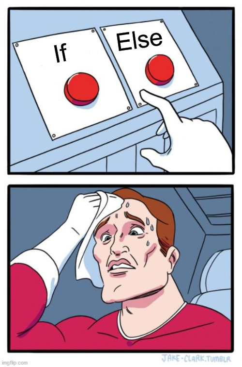

<h1 align="center">Grundlagen der Programmierung</h1>
<h3 align="center">Verzweigungen</h3>
<br>

<p align="center">
  
</p>

#### Beschreibung:

- Willkommen in der neuen Woche! In dieser Woche beschäftigen wir uns mit Verzweigungen. Die Grundlagen hast du ja heute bereits in der Vorlesung kennengelernt. Wir beginnen jetzt damit die erste eigene Verzweigung zu schreiben.


#### Hinweise zur Bearbeitung:

- Lies erst die ganze Aufgabenstellung, bevor du die Aufgabe bearbeitest.
- Achte auf einen sauberen Quellcode, insbesondere Einrückungen sind wichtig!
- Nutze den Debugger, wenn du nicht mehr weiter weißt.
- Wichtige Materialien für heute:
  - [Handbuch: Verzweigungen → Verstehen → Verzweigungen](https://docs.google.com/document/d/13SyoQ3tgIr4T9tiUl42V5kiBGQwV4Lk-XA2SsKf-va0/edit#heading=h.upnts13xkegu)
  - [Handbuch: Verzweigungen → Implementieren → If-Else-Verzweigung implementieren](https://docs.google.com/document/d/13SyoQ3tgIr4T9tiUl42V5kiBGQwV4Lk-XA2SsKf-va0/edit#heading=h.rlmqv2gebsn2)
  - [Handbuch: Verzweigungen → Implementieren → When-Verzweigung implementieren](https://docs.google.com/document/d/13SyoQ3tgIr4T9tiUl42V5kiBGQwV4Lk-XA2SsKf-va0/edit#heading=h.qc6ti3gecmoi)


---

<details>
<summary> <b>Aufgabe 1 - Vorhersagen, wohin Programmfluss als Nächstes hinspringen wird (If-Else-Verzweigung) </b> </summary>

Die Konstante sunny vom Typ Boolean gibt an, ob die Sonne scheint oder nicht.

Schau dir den Codeausschnitt an.
- Was wird hier ausgegeben?

Notiere dir deine Antwort. (z.B. in einem Kommentar)  
Führe dann den Code aus.
- Wird das ausgegeben, was du dir notiert hast?


```
fun main() {
    val sunny = false;

    if (sunny) {
        println("Heute scheint die Sonne!")
    } else {
        println("Leider sieht es heute nicht nach Sonne aus.")
    }
}
```

**Modul für die Aufgabe:** *Aufgabe1*  
**Datei für die Aufgabe:** *1_IfElseVorhersage.kt*

</details>

---


<details>
<summary> <b>Aufgabe 2 - Vorhersagen, wohin Programmfluss als Nächstes hinspringen wird (If-Else-Verzweigung) </b> </summary>

Es handelt sich hierbei um die gleiche Aufgabe wie in der vorherigen nur wird nun zusätzlich überprüft ob es wolkig ist, wenn es nicht sonnig ist.
Die Konstante cloudy vom Typ Boolean gibt an, ob es wolkig ist.

Schau dir den Codeausschnitt an.
- Was wird hier ausgegeben?

Notiere dir deine Antwort. (z.B. in einem Kommentar)  
Führe dann den Code aus.
- Wird das ausgegeben, was du dir notiert hast?

```
fun main() {
    val sunny = false;
    val cloudy = true

    if (sunny) {
        println("Heute scheint die Sonne!")
    } else {
        if (cloudy) {
            println("Leider scheint heute nicht die Sonne und es ist bewölkt.")
        } else {
            println("Es scheint zwar nicht die Sonne aber es ist auch nicht zu wolkig.")
        }
    }
}
```


**Modul für die Aufgabe:** *Aufgabe2*  
**Datei für die Aufgabe:** *2_IfElseVorhersage.kt*

</details>

---


<details>
<summary> <b>Aufgabe 3 - Vorhersagen, wohin Programmfluss als Nächstes hinspringen wird (If-Else-Verzweigung) </b> </summary>

Wir erweitern unser Konstrukt um eine weitere Abzweigung:
Wenn es bewölkt ist, kann es nun auch noch regnen.
Ob es regnet, wird durch die Konstante rainy angegeben.

a)

Schau dir den Codeausschnitt an.
- Was wird hier ausgegeben?

Notiere dir deine Antwort. (z.B. in einem Kommentar)  
Führe dann den Code aus.
- Wird das ausgegeben, was du dir notiert hast?

```
fun main() {
    val sunny = false;
    val cloudy = true
    val rainy = true;

    if (sunny) {
        println("Heute scheint die Sonne!")
    } else {
        if (cloudy) {
            if (rainy) {
                println("Heute regnet es!")
            } else {
                println("Leider scheint heute nicht die Sonne und es ist bewölkt.")
            }
        } else {
            println("Es scheint zwar nicht die Sonne aber es ist auch nicht zu wolkig.")
        }
    }
}
```

b)

- Was wird ausgegeben, wenn die Konstanten wie folgend gesetzt sind?
- Überlege dir erst eine Antwort, notiere sie dir, ersetze die Konstanten im Programm mit den neuen Konstanten,
führe dann das Programm aus. Wird das ausgegeben, was du dir notiert hast?
```
sunny = false, 
cloudy = true, 
rainy = false
```

c)

- Was wird ausgegeben, wenn die Konstanten wie folgend gesetzt sind?
- Überlege dir erst eine Antwort, notiere sie dir, ersetze die Konstanten im Programm mit den neuen Konstanten,
  führe dann das Programm aus. Wird das ausgegeben, was du dir notiert hast?
```
sunny = false, 
cloudy = false, 
rainy = false
```

**Modul für die Aufgabe:** *Aufgabe3*  
**Datei für die Aufgabe:** *3_IfElseVorhersage.kt*

</details>

---

<details>
<summary> <b>Aufgabe 4 - Vorhersagen, wohin Programmfluss als Nächstes hinspringen wird (When-Verzweigung) </b> </summary>

Mit Hilfe des Geburtsjahres soll ein Kind in die passende Gruppe im Fußballverein eingeteilt werden. 
Die Konstante birthyear gibt dabei das Geburtsjahr des Kindes an.

a)

Schau dir den Codeausschnitt an.
- Was wird hier ausgegeben?

Notiere dir deine Antwort. (z.B. in einem Kommentar)  
Führe dann den Code aus.
- Wird das ausgegeben, was du dir notiert hast?


```
fun main() {
    val birthyear: Int = 2011

    when (birthyear) {
        2010 -> println("Kind ist in Gruppe A")
        2011 -> println("Kind ist in Gruppe B")
        2012 -> println("Kind ist in Gruppe C")
        2013 -> println("Kind ist in Gruppe D")
        2014 -> println("Kind ist in Gruppe E")
        else -> println("Für dieses Geburtsjahr gibt es keine Gruppe")
    }
}
```

- Was wird ausgegeben, wenn die Konstante birthyear den Wert 2013 hat?  
Überlege dir erst eine Antwort, notiere sie, ersetze dann den Wert der Konstante mit 2013, 
führe den Code aus und überprüfe dein Ergebnis. Wird das ausgegeben, was du dir notiert hast?


- Was wird ausgegeben, wenn die Konstante birthyear den Wert 1995 hat? 

**Modul für die Aufgabe:** *Aufgabe4*  
**Datei für die Aufgabe:** *1_WhenVorhersage.kt*

</details>

---

<details>
<summary> <b>Aufgabe 5 - Vorhersagen, wohin Programmfluss als Nächstes hinspringen wird (When-Verzweigung) </b> </summary>

Mit Hilfe einer When Verzweigung soll die Nationalität eines Ausweises ausgelesen werden.
Die Nationalität ist hierbei in einem String gespeichert. </br>

Schau dir den Codeausschnitt an.
- Was wird hier ausgegeben?

Notiere dir deine Antwort. (z.B. in einem Kommentar)  
Führe dann den Code aus.
- Wird das ausgegeben, was du dir notiert hast?

```
fun main() {
    val nationality: String = "japanese"

    when (nationality) {
        "german" -> println("Nationalität: Deutsch")
        "italian" -> println("Nationalität: Italienisch")   
        "japanese" -> println("Nationalität: Japanisch")    
        "namibian" -> println("Nationalität: Namibisch")   
        "brazilian" -> println("Nationalität: Brasilianisch")     
        else -> println("Nationalität nicht in Datenbank")  
    }
}
```

- Was wird ausgegeben, wenn die Konstante nationality den Wert "canadian" hat?  
  Überlege dir erst eine Antwort, notiere sie, ersetze dann den Wert der Konstante mit "canadian",
  führe den Code aus und überprüfe dein Ergebnis. Wird das ausgegeben, was du dir notiert hast?


**Modul für die Aufgabe:** *Aufgabe5*  
**Datei für die Aufgabe:** *2_WhenVorhersage.kt*

</details>

---

<details>
<summary> <b>Aufgabe 6 - Vorhersagen, wohin Programmfluss als Nächstes hinspringen wird (When-Verzweigung) </b> </summary>

Dieses Programm gibt an, ob eine Prüfung bestanden wurde oder nicht.
Die Note der Prüfung wird in der Konstante note angegeben.

Schau dir den Codeausschnitt an.
- Was wird hier ausgegeben?

Notiere dir deine Antwort. (z.B. in einem Kommentar)  
Führe dann den Code aus.
- Wird das ausgegeben, was du dir notiert hast?


```
fun main() {
    val note: Int = 5
    when (note)  {
        1 -> println("Bestanden!")
        2 -> println("Bestanden!")
        3 -> println("Bestanden!")
        4 -> println("Bestanden!")
        else -> println("Nicht bestanden!")
    }
}
```

**Modul für die Aufgabe:** *Aufgabe6*  
**Datei für die Aufgabe:** *3_WhenVorhersage.kt*

</details>

---

<details>
<summary> <b>Aufgabe 7 - Auto-Software </b> </summary>

Wir brauchen eine Software für ein Auto. Die Software soll nur starten, 
wenn der Motor an ist und alle Türen geschlossen sind. 

- Schreibe eine Funktion. Die Funktion erhält zwei Parameter vom Typ Boolean,
einmal isMotorRunning, das angibt, ob der Motor an ist und einmal doorsAreClosed, das angibt, dass alle Türen geschlossen sind.  
- Verwende in deiner Funktion eine If-Else Verzweigung.
- Wenn der Motor läuft und die Türen geschlossen sind, soll unsere Funktion
  die Funktion start() aufrufen. 
- Wenn der Motor läuft, aber die Türen nicht geschlossen sind, soll unsere Funktion 
die Funktion closeDoors() aufrufen.


- Teste deine Funktion, indem du sie in der main()-Funktion mit den Parametern  
true und true aufrufst. In der Konsole sollte "Software gestartet." ausgegeben werden.
- Teste deine Funktion, indem du sie in der main()-Funktion mit den Parametern  
  true und false aufrufst. In der Konsole sollte "Bitte alle Türen schließen." ausgegeben werden.

**Modul für die Aufgabe:** *Aufgabe7*  
**Datei für die Aufgabe:** *AutoSoftware.kt*

</details>

---

<details>
<summary> <b>Aufgabe 8 - Login-Webseite </b> </summary>

Wir wollen die Software für eine Login-Webseite schreiben.
Dazu brauchen wir eine Funktion, die überprüft, ob der Nutzer auf der Webseite
erlaubt ist, das Passwort stimmt und ob die Verbindung sicher ist.
Die Funktion gibt dann eine Statusmeldung als String zurück.

- Schreibe eine Funktion. Die Funktion erhält drei Parameter vom Typ Boolean.  
Einmal userAccepted, das angibt, ob der Nutzer erlaubt ist,  
einmal passwordOk, das angibt, ob das Password stimmt  
und einmal connectionSecure, das angibt, ob die Verbindung sicher ist.
- Verwende in deiner Funktion eine If-Else Verzweigung.
- Wenn der Nutzer nicht erlaubt ist, gibt die Funktion "User denied." zurück.
- Wenn der Nutzer erlaubt ist, aber das Passwort falsch ist, gibt die Funktion
"False password." zurück.
- Wenn der Nutzer erlaubt ist, das Passwort stimmt, aber die Verbindung unsicher ist,
gibt die Funktion "Unsafe connection." zurück.
- Wenn der Nutzer erlaubt ist, das Passwort stimmt und die Verbindung sicher ist,
gibt die Funktion "Ok." zurück.


Teste deine Funktion, indem du sie in der main()-Funktion mit den folgenden Parametern aufrufst
und den Rückgabewert der Funktion mit der println()-Funktion in der Konsole ausgibst.
```
Parameter:              Konsolenausgabe:

false, false, false     "User denied."
true,  false, false     "False password."
true,  true,  false     "Unsafe connection."
true,  true,  true      "Ok."
```


**Modul für die Aufgabe:** *Aufgabe8*  
**Datei für die Aufgabe:** *LoginWebseite.kt*

</details>


---


<details>
<summary> <b>Aufgabe 9 - Monat </b> </summary>

In dieser Aufgabe sollst du eine When-Verzweigung schreiben, 
die den Namen eines Monats ausgibt.
Der Monat wird dabei als Zahl in der Konstante month angegeben.
Jeder Monat hat dabei die Zahl, wie man sie in einem Datum verwendet.
Wenn die Zahl keinen Monat darstellt (z.B. 420), dann soll eine Fehlermeldung ausgegeben werden.

Die Monate:     
Januar -> 1   
Februar -> 2  
März -> 3   
April -> 4  
Mai -> 5   
Juni -> 6  
Juli -> 7  
August -> 8  
September -> 9  
Oktober -> 10  
November -> 11  
Dezember -> 12

Wenn also die Konstante month die Zahl 7 hat, soll in der Konsole über die println()-Funktion "Juli" ausgegeben werden.
Und wenn die Konstante month die Zahl 11 hat, soll in der Konsole "November" ausgegeben werden.

Teste dann dein Programm, indem du für month verschiedene Monatszahlen eingibst. Kommt jeweils der richtige Monat raus?
Teste dann dein Programm auch mit dem Wert 82 für die Konstante month. Wird die Fehlermeldung ausgeben?

**Modul für die Aufgabe:** *Aufgabe9*  
**Datei für die Aufgabe:** *Monat.kt*

</details>


---

<details>
<summary> <b>Aufgabe 10 - Prämie </b> </summary>

Alle Bestandskunden eines Mobilfunkanbieters sollen eine Prämie erhalten. 
Die Firma existiert erst seit 5 Jahren, es gibt also keinen Bestandskunden, der länger dabei ist als 5 Jahre.
Die Vertragsdauer eines Bestandskunden wird in der Konstante duration in Jahren angegeben.

Die Belohnungen sehen wie folgt aus:
- Genau 1 Jahr  -> 5€ Amazon-Gutschein Prämie
- Genau 2 Jahre -> 15€ Amazon Gutschein Prämie
- Genau 3 Jahre -> 25€ Amazon Gutschein Prämie
- Genau 4 Jahre -> 35€ Amazon Gutschein Prämie
- Genau 5 Jahre -> 50€ Amazon Gutschein Prämie


Schreibe in der main()-Funktion eine When Verzweigung, das anhand der Vertragsdauer in der Konstante duration 
die Prämie in der Konsole ausgibt.

Teste dein Programm, indem du den Wert der Konstante duration änderst und dann das Programm laufen lässt.  
Teste dein Programm mit diesen Werten und prüfe, ob das Richtige in der Konsole ausgegeben wird:

```
    val duration: Int = 1   -> "5€ Amazon-Gutschein Prämie"
    val duration: Int = 2   -> "15€ Amazon Gutschein Prämie"
    val duration: Int = 3   -> "25€ Amazon Gutschein Prämie
    val duration: Int = 4   -> "35€ Amazon Gutschein Prämie"
    val duration: Int = 5   -> "50€ Amazon Gutschein Prämie"
```

Also wenn die Konstante duration den Wert 1 hat, soll "5€ Amazon-Gutschein Prämie" in der Konsole
ausgegeben werden.


**Modul für die Aufgabe:** *Aufgabe10*  
**Datei für die Aufgabe:** *Praemie.kt*


</details>

---


