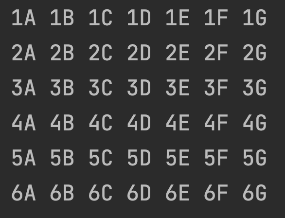

<h1 align="center">Grundlagen der Programmierung</h1>
<h3 align="center">Schleifen</h3>
 

#### Beschreibung:
Willkommen bei den Bonusaufgaben zu Tag 21!
In diesen Aufgaben vertiefst du dein Wissen über Schleifen.

#### Hinweise zur Bearbeitung:

- Achte auf einen sauberen Quellcode, insbesondere Einrückungen sind wichtig!
- Wichtige Materialien für heute:
  - [Handbuch: Schleifen → Verstehen → Programmfluss und Laufvariablen](https://docs.google.com/document/d/13SyoQ3tgIr4T9tiUl42V5kiBGQwV4Lk-XA2SsKf-va0/edit#heading=h.khc665cedvja)
  - [Handbuch: Schleifen → Implementieren → Laufvariablen implementieren](https://docs.google.com/document/d/13SyoQ3tgIr4T9tiUl42V5kiBGQwV4Lk-XA2SsKf-va0/edit#heading=h.4b4isj8cze29)
  - [Handbuch: Schleifen → Implementieren → while-Schleife implementieren](https://docs.google.com/document/d/13SyoQ3tgIr4T9tiUl42V5kiBGQwV4Lk-XA2SsKf-va0/edit#heading=h.hf34b5wgif84)
  - [Handbuch: Listen → Implementieren → Größe einer Liste lesen](https://docs.google.com/document/d/13SyoQ3tgIr4T9tiUl42V5kiBGQwV4Lk-XA2SsKf-va0/edit#heading=h.bvtmwoufzcex)
  - [Handbuch: Listen → Implementieren:MutableList → Wert in MutableList an Index ändern](https://docs.google.com/document/d/13SyoQ3tgIr4T9tiUl42V5kiBGQwV4Lk-XA2SsKf-va0/edit#heading=h.x824jd5wl02t)

---

 <b> Aufgabe 1 - Popstarnamen </b> 

In der Datei findest du eine Liste an Vornamen und eine Liste an Nachnamen.
Deine Aufgaben ist es, für jede Person Vor- und Nachname Auszugeben.

**Datei für die Aufgabe:** *src > 01PopstarNamen.kt*

---

 <b> Aufgabe 2 - Verschachtelte Schleifen </b> 

Vorsicht, Knobelaufgabe!

Deine Aufgabe ist es eine Zahlenmatrix, wie unten auszugeben (Tipp: du brauchst 2 Schleifen ineinander).

  

**Datei für die Aufgabe:** *src -> 02SchleifenSchachteln.kt*

---

 <b> Aufgabe 3 - Bonus </b> 

Bei dieser Aufgabe geht es darum, herauszufinden, welche Zahl am häufigsten in der Liste vorkommt.
Gib die Zahl, die am häufigsten vorkommt, mit println aus.

**Datei für die Aufgabe:** *src > 03VorkommenZählen.kt*

---

 <b> Aufgabe 4 - Primzahlen Filtern </b> 

Bei dieser Aufgabe wird es wieder kniffelig: Wir wollen in der Funktion primZahlFilter eine Liste übergeben, bei der für jedes Element bestimmt wird, ob es eine Primzahl ist oder nicht, und dieses Information in die Konsole ausgedruckt wird. Überlegt euch, wie wir mit Modulo (%) arbeiten können. Tipp: Eine Primzahl ist eine Zahl, die nur durch sich selbst und 1 teilbar ist.

Nehmt gerne google zur Hilfe, wenn ihr nicht weiterkommt, oder fragt die Tutoren.

**Datei für die Aufgabe:** *src > 04PrimzahlenFiltern.kt*

---

 <b> Aufgabe 5 - Silvester </b> 

Hier kannst du deiner Kreativität freien Lauf lassen!

Es ist Silvester und eine Party muss organisiert werden.
Dazu erstellst du 2 gleich lange Listen, eine Gästeliste mit Namen und eine mit Party-Ausrüstung, die beschafft werden muss (Dekoration, Essen, Feuerwerk, etc.)
Mit einer Schleife sollen in der Funktion "aufgabenZuteilung" die Namen mit je einer Aufgabe ausgedruckt werden, sodass wir wissen, wer für was verantwortlich ist.

Außerdem brauchen wir eine Funktion "countdown". Sie soll bis Mitternacht von 10 runterzählen. Stelle sicher, dass der Countdown zur richtigen Uhrzeit (23.59, einfach als Double speichern) beginnt und fange eine Exception ab mit try-catch, falls er zu früh getriggert wird.
Der Countdown soll, wenn er bei 0 ankommt, stattdessen "Happy New Year!" ausgeben.

Wir brauchen außerdem eine Funktion Trinkspiel, die einen Namen aus der Liste übergeben bekommt: Es wird mal wieder gewürfelt und die spielende Person muss pro Augenzahl ein Schluck nehmen.
Jeder Schluck soll in der Konsole nach folgendem Schema geprinted werden:
"[name] nimmt den [i]ten Schluck!"

Fallen dir weitere Situationen ein, die wir Simulieren könnten?

**Datei für die Aufgabe:** *src > Silvester.kt*

---