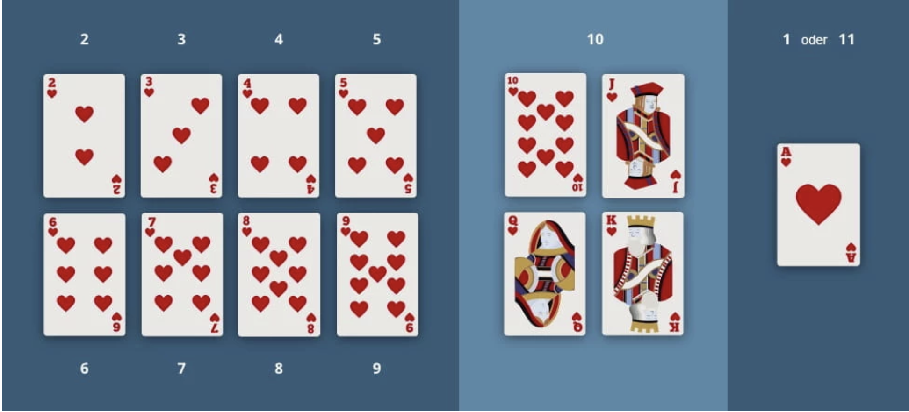

<h1 align="center">Grundlagen der Programmierung</h1>
<h3 align="center">Schleifen</h3>

  

 <b> Beschreibung </b> 

Willkommen zurück zu den Übungen an Tag 25. Heute wiederholen wir alles, was wir diese Woche gelernt haben.

Aber damit es uns nicht langweilig wird, werden wir die heutigen Aufgaben wieder in ein größeres Projekt packen.
Wir wollten vor 2 Wochen mit unseren Freund/innen Karten spielen.
Heute hat leider niemand Zeit mit uns Karten zu spielen.
Aber macht nichts! Wir programmieren uns unser eigenes Spiel!

Heute gibt es eine Runde Black Jack!

 <b> Black Jack Regeln </b> 

<h3 align="center">Black Jack Regeln</h3>
 

Hier erstmal die Regeln, mit denen wir spielen werden:

Beim Blackjack spielt man gegen den Dealer. Bei uns wird der Dealer von unserem Programm gespielt.
Das Ziel des Spiels besteht darin, den Dealer zu schlagen.
Dafür müsst ihr mit zwei oder mehr Spielkarten näher an 21 Punkte kommen, als der Dealer.
Habt ihr den gleichen Wert wie der Dealer ist es ein Unentschieden.
Habt ihr am Ende mehr als 21 Punkte, oder habt ihr weniger Punkte als der Dealer,
habt ihr verloren.

Beim BlackJack spielt man um Geld, das heißt wir müssen vor jeder Runde Geld einsetzen.
Entweder verlieren wir oder wir verdoppeln unseren Einsatz.
Bei einem Unentschieden bekommen wir unser Geld wieder.

<b>Jede Runde sieht wie folgt aus:</b>

Zuerst bekommt der Spieler und der Dealer zwei Karten.
Der Spieler sieht dabei nur eine Karte des Dealers, die andere ist verdeckt.
Der Spieler darf so lange er will weitere Karten ziehen, außer er hat bereits mehr als 
21 Punkte, dann hat er die Runde verloren.
Sobald der Spieler zufrieden ist und nicht über 21 Punkte hat, 
wird die Hand des Dealers aufgedeckt.
Nun muss der Dealer so lange Karten ziehen, bis er mindestens 17 Punkte hat.
Kommt der Dealer dabei über 21 Punkte, hat der Dealer verloren.

<b>Wer hat gewonnen?</b>

- Der Spieler hat gewonnen, wenn er mehr Punkte hat, als der Dealer.  
- Der Spieler hat direkt gewonnen, wenn er mit den ersten beiden Karten auf 21 Punkte kommt.  
- Kommt der Dealer auf über 21 Punkte, hat der Spieler gewonnen.

<b>Die Kartenwerte (Punkte):</b>  

Bei Black Jack müsst ihr euch nicht um die Farben kümmern, es Zählen nur die Zahlen.
Dabei gilt, das jede Zahl auf der Karte auch den Wert hat.
Also eine Herz 2 bringt 2 Punkte, eine Herz 3 bringt 3 Punkte, usw.
Bube, Dame und König bringen 10 Punkte und das Ass bringt manchmal 1 Punkt und manchmal 11
(Wir vereinfachen unser Black-Jack, hier bringt ein Ass erstmal 11 Punkte).
Ihr sehr es auch nochmal auf dem Bild unten.

  

<h3 align="center">Aufgaben</h3>

 <b> Aufgabe 1 - Das Kartendeck </b> 

Heute programmieren wir eine vereinfachte Version des beliebten amerikanischen Spiels “Black Jack”.  
In unserem Programm ist eine Karte dargestellt als ein String, z.B.: `"Kreuz 7"`
und ein Deck ist eine Liste mit Karten, also eine Liste vom Typ String.

Wir haben euch 
bereits einige Funktionen zur Verfügung gestellt, die euch dabei helfen werden.
Wir stellen euch folgende 3 Funktionen zur Verfügung:

<b>mischen():</b> 

Diese Funktion erwartet ein Deck als MutableListe.  
Es mischt dieses durch.

<b>karteZiehen():</b> 

Diese Funktion erwartet ein Deck als MutableListe.  
Es zieht die oberste Karte des Decks und gibt die Karte als Rückgabewert wieder.

<b>kartenWert():</b> 

Diese Funktion erwartet eine Karte als String.  
Sie berechnet die Punkte der Karte in BlackJack und gibt ihn als Integer zurück.

Unter der globalen Konstanten “kartendeck” findet ihr ein Deck von Karten. Dieses Deck sollte von eurem Code nicht 
verändert werden. Wenn ihr also mit einem Deck von Karten arbeiten möchtet, macht euch eine Kopie davon, 
z.B. mit .toMutableList().
Ein Beispiel dazu findet ihr bereits in der main() Funktion.

 <b> Aufgabe 2 - Die Punktzahl der Hand </b> 

Zuerst benötigen wir eine Funktion, die die gesamte Punktzahl einer Hand zurückgibt.  
Eine Hand von Karten wird als MutableListe von Karten (Strings) dargestellt (Siehe Aufgabe1).  
Erstellt eine Funktion mit einem geeigneten Namen, Parameter(n) und Rückgabewert.  
In dieser Funktion solltet ihr mithilfe einer Schleife die gesamte Punktzahl einer Hand berechnen.  
Ein Ass ist hier 11 Punkte wert.  
Die Punktzahl einer Karte erhält man über die Funktion kartenWert().

Testet anschließend diese Funktion in der main()-Funktion mit einigen Beispiel Händen.

 <b> Aufgabe 3 - Hand ziehen </b> 

Als nächstes benötigen wir eine Funktion, die eine Hand zurückgibt.  
Die Funktion soll als Parameter ein Deck bekommen, von dem die Karten
gezogen werden und einen Parameter, das angibt, ob die Hand 
für den Spieler oder für den Computer ist.
In der Funktion werden dann zwei Karten vom Deck
gezogen und in die Hand gelegt.  
Wenn die Hand für den Spieler ist, gib beide Karten über die Konsole aus.  
Wenn die Hand für den Computer ist, gib die Karte von den zwei Karten
in der Konsole aus, die mehr Punkte wert ist.  
Anschließend wird die Hand zurückgegeben.

Denkt dran, das Deck mindestens einmal (mit der kartenMischen()-Funktion) gemischt zu haben,  
bevor du davon Karten ziehst.

Testet innerhalb der main() aus, ob eure Funktion richtig funktioniert.

 <b> Aufgabe 4 - Zu hohe Punkte </b> 

Nun benötigen wir eine Funktion, die testet, ob eine Hand mehr als 21 Punkte hat und somit verloren hat. Als Parameter 
erwartet die Funktion eine Hand als MutableList, und als Rückgabewert bekommt man einen Boolean. 
Wenn die Hand mehr als 21 Punkte wert ist, ist der Boolean true, ansonsten false.

 <b> Aufgabe 5 - Hit and Stand </b> 

Als nächstes benötigen wir eine Funktion, die dem Spieler ermöglicht, weitere Karten 
ziehen zu können.
Der Spieler wird über die Konsole gefragt, ob er eine weitere Karte ziehen möchte ("hit")
oder ob er es lassen will ("stand").
Die Antwort des Spielers wird über die Konsole mit der readln()-Funktion eingelesen.

Nachdem eine Karte gezogen wurde, soll die aktualisierte Hand und die Punktzahl
der Hand über die Konsole ausgegeben werden.  
Ebenfalls muss nach jeder gezogenen Karte zunächst geprüft werden, ob die Hand verloren 
hat, also ob die Hand mehr als 21 Punkte wert ist.

Schreibt euch also eine geeignete Schleife, die so lange läuft, bis der Spieler verloren hat, oder keine Karten 
mehr ziehen möchte.

 <b> Aufgabe 6 - Der Dealer ist am Zug </b> 

Wenn der Spieler keine Karten mehr möchte, zieht der Dealer.
Der Dealer ist verpflichtet, neue Karten zu ziehen, solange seine Hand weniger als 17 Punkte wert ist.
Ist seine Hand mehr als 17 Punkte wert, hört der Dealer auf zu ziehen.  
Schreibt euch dafür wieder eine geeignete Schleife.  
Ihr solltet auch hier nach jeder gezogenen Hand überprüfen, ob der Dealer bereits verloren (Punktezahl der Hand > 21) hat.

 <b> Aufgabe 7 - Wer hat gewonnen? </b> 

Wenn auch der Dealer keine Karten mehr zieht, wird entschieden, wer diese Runde gewinnt.
Vergleicht dazu den Wert der beiden Hände und gebt den entsprechenden Gewinner in der Konsole aus. Wenn der Spieler
oder Dealer bereits zuvor ausgeschieden ist, könntet ihr bereits vorher den Gewinner bestimmen.

 <b> Aufgabe 8 - Money,Money,Money </b> 

Black Jack wird in der Regel mit Geld Einsätzen gespielt, die wir nun in dieser Aufgabe hinzufügen.
Legt zunächst erstmal ein Konto an, welches das Guthaben der Spieler speichert. Erstellt das Konto mit
einem Startwert von 100 Euro.

Am Anfang einer Spielrunde soll der Spieler nun gefragt werden, wie viel Geld er davon einsetzen möchte. 
Prüft dabei, ob auch genug Geld auf dem Konto ist. Verhindert, dass der Spieler mit einer falschen Eingabe euer 
Programm zum Absturz führen kann.

Am Ende einer Spielrunde soll automatisch dem Konto der entsprechende Gewinn oder Verlust zugeschrieben werden. 
Bei einem Sieg erhält man das Doppelte des Einsatzes als Gewinn. Bei Unentschieden bekommt man seinen Einsatz zurück.
Bei einer Niederlage verliert man seinen Einsatz.

 <b> Aufgabe 9 - Das ganze Spiel </b> 

Nun sollten wir alle Bausteine besitzen, um die komplette Logik von BlackJack zu erstellen. Innerhalb eurer main()-Funktion
sollt ihr dafür eine Schleife implementieren, die solange neue Spielrunden beginnt, bis der Spieler kein
Geld mehr hat, oder aufhören möchte zu spielen.

 <b> Bonus 1 - Ass im Ärmel </b> 

In Black Jack ist der Wert des Asses flexibel. Wenn eine Hand, die ein Ass enthält, einen Wert von 21 übersteigt,
wird das Ass als 1 Punkt gewertet. Überlegt euch, wie ihr diese Regel in euer Spiel mit einbauen könnt.

 <b> Bonus 2 - Karten, überall Karten </b> 

Normalerweise wird Blackjack nicht mit einem einzelnen Kartendeck gespielt. In den meisten Casinos mischt man 6 Decks 
von Karten zusammen. In diesem Fall wird nicht nach jeder Spielrunde gemischt, sondern z.B nur alle 5 Runden, oder wenn
das Deck fast leer ist (z.B weniger als 20 Karten).
Überlegt euch wieder, wie ihr diese Extra Regel in euer Spiel mit einbauen könnt.  

